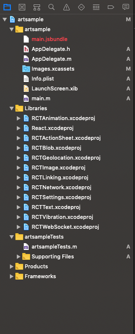
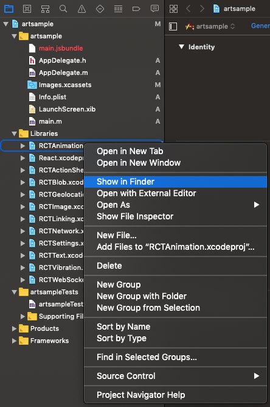
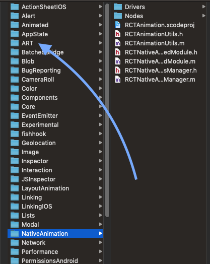
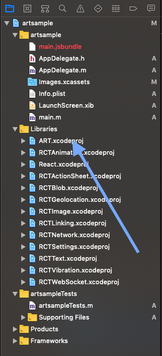
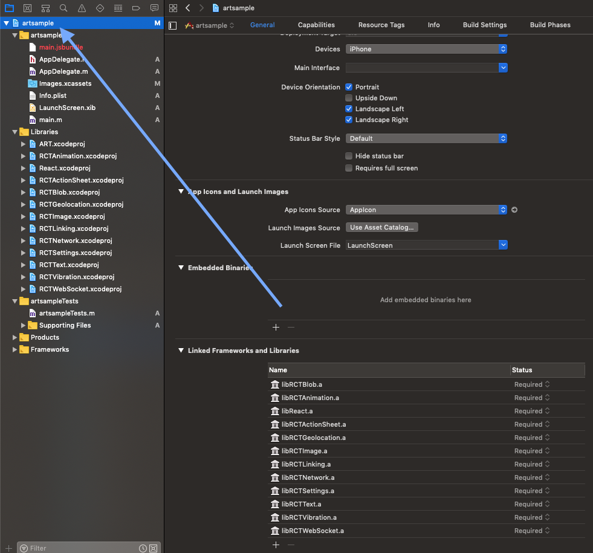
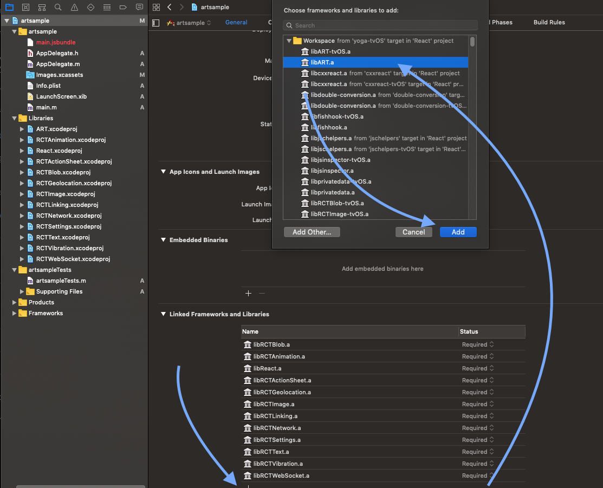

# Learning how to use React Native Art

This simple repo, is just a demostration of how to include and use react native ART in your project.

## What is react native art?

Have you ever seen inception? A dream inside a dream inside a dream...

React Native Art is a port of [React ART](https://github.com/reactjs/react-art), which is a port of [ART](https://github.com/sebmarkbage/art/), which is an implementation of vector graphics (or vector drawing), allowing you to create beautiful graphics rendered on the spot, pixel perfect for each device.

## Documentation

Unfortunately, there is not much documentation available as Facebook has not dedicated enough time to this.

However, some of the guys from React Native China have dedicated a bit of time to copy from ART the documentation available there in [here](https://github.com/react-native-china/react-native-ART-doc/blob/master/doc.md)... Again, not super helpful but at least you get a bit more information.

## Is there another sample?

Other than the one written down in the [tester](https://github.com/facebook/react-native/blob/master/RNTester/js/ARTExample.js)... nope!

## How to configure ART in my react native project?

Assuming you have a project already configured (step below)

```
react-native init myartsample
```
<sub>**Note**: do not call your sample project art... it will clash with react native ART library and your project does not bundle</sub>

All you need to do is:

### iOS

1. Open your project in xcode (`open ./ios/myartsample.xcodeproj`) and expand your library section:



2. Then right click (or ctrl+click) on any of the libraries and select "show in finder" (you just need to open react-native's node module folder).
3. 


3. Then choose the ART folder



4. Drag `ART.xcodeproj` into your libraries section in xcode.



5. Tap on your project (right at the top)



6. In the General tab, go to `linked frameworks and libraries` and tap on `+`, search for `libART.a` and tap on `add`



Now you should be able to write some code using these new components. Or copy and paste the code uploaded here (same as their test... less obnoxious colors)

## Android

I couldn't find any other step I had to do... Once I got it to work in iOS, ran the same code in Android and it worked (maybe the dependency is always there)